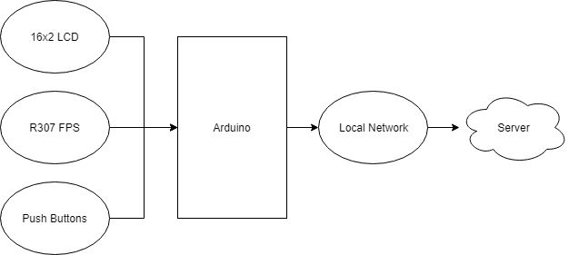
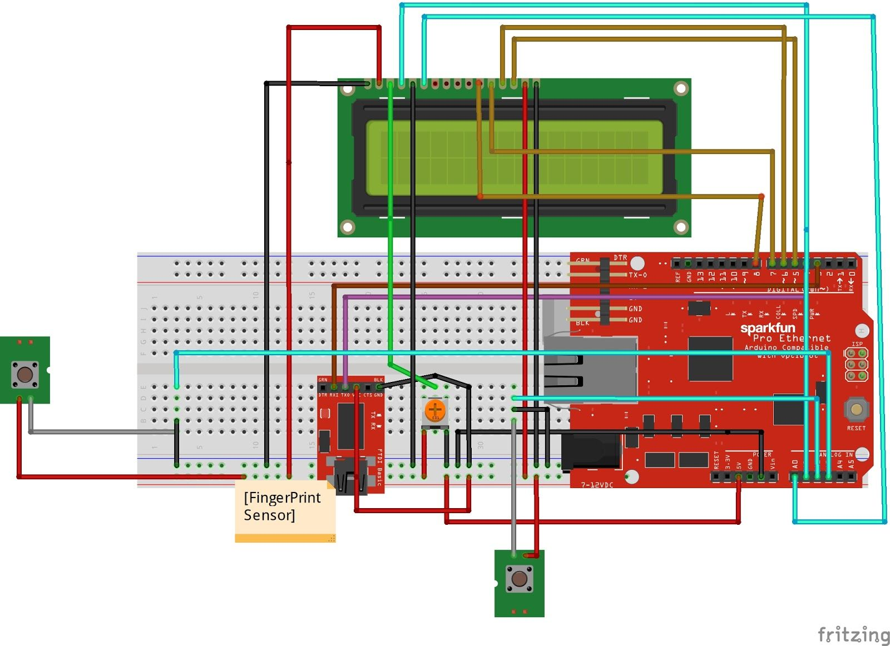
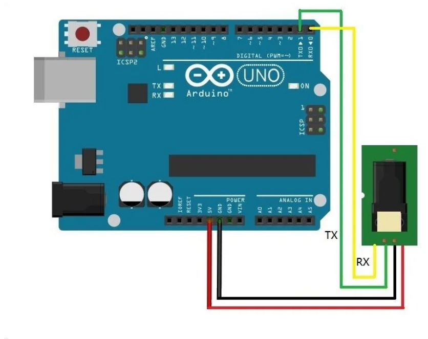
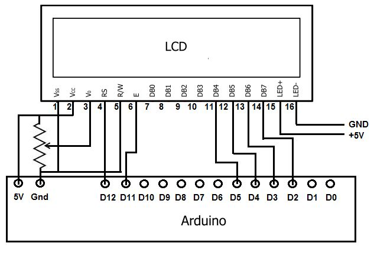
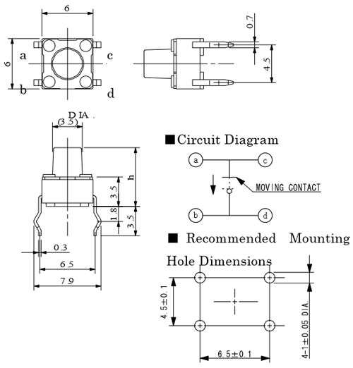
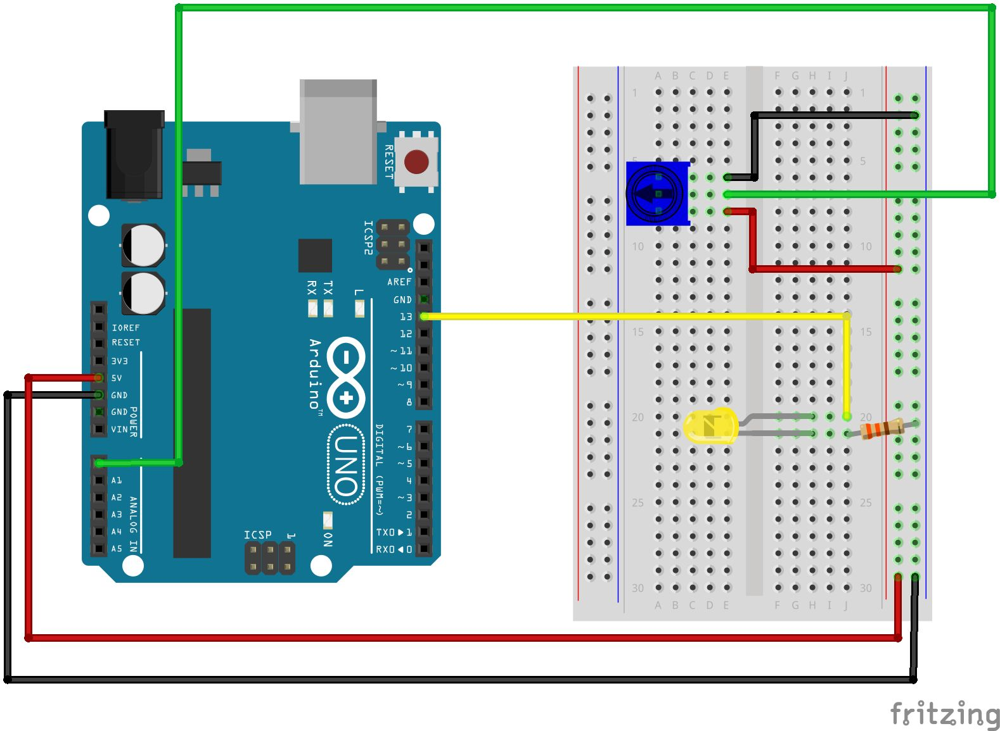
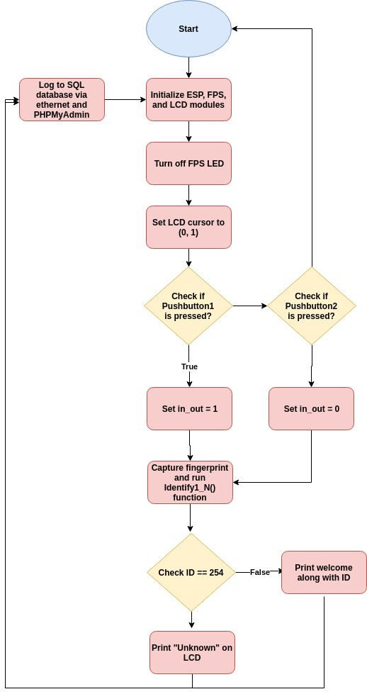

# Arduino Biometric Attendance Solution

## Project Overview
In May 2022, I developed and introduced the Arduino Biometric Attendance Solution, a revolutionary biometric system that I've successfully implemented across multiple organizations at Baylor University. Built using the robust Arduino platform, I designed the system with a primary focus on accurate attendance tracking and strict data security, incorporating stringent communication protocols and advanced encryption techniques.

## Project Inspiration
In the era of Smart Cities and the Internet of Things (IoT), our interactions with the world around us are rapidly changing. Attendance, a crucial component in academic and professional environments, has long needed an upgrade to keep pace with these developments. Traditional methods such as roll call or manual sign-in processes are not only time-consuming but also prone to errors. Hence, we decided to harness the power of advanced biometric technology known for its precision and security, while maintaining portability. This system's integration with cloud computing provides secure data storage and easy access whenever required.

## Project Details
This project's objective was to intertwine IoT technology with conventional attendance systems, making them smarter and more efficient. Unlike traditional systems that store data on micro SD cards and need a computer for data access, our solution employs Arduino to scan fingerprints and, upon successful identification, logs the attendance data onto a cloud platform. Using the ESP8266 Wi-Fi module, this information is relayed to platforms like ThingsBoard. This enables the authorities to view and analyze data over the internet without any direct physical interaction with the hardware.

## System Diagram

## Circuit Schematic

## Necessary Components
The following components were used in this project:
  * Arduino UNO
  * 16x2 LCD Display
  * Ethernet Shield
  * R307 Fingerprint sensor (FPS)
  * Jumper wires
  * Push Buttons
  * Potentiometer
  * Resistors

## Working Principle
The R307 fingerprint sensor module and a 16x2 LCD display, along with an Arduino UNO, are the primary components in this setup. The fingerprint sensor captures a user's fingerprint data. The Arduino UNO serves as the central microcontroller that manages the data input from the sensor and the user interaction via push buttons. The Ethernet Shield aids in connecting the system to the internet, while the LCD display provides a user interface for the system.

The check-in and check-out times are logged upon the successful detection and verification of fingerprints when a user presses the corresponding button. This data is then securely transmitted and stored in a database, ready to be accessed when needed.

   
   *Fingerprint Sensor Interfacing using Arduino*
        
 # 16x2 LCD Display:
  Character lcd's come in many sizes 8x1, 8x2, 10x2, 16x1, 16x2, 16x4, 20x2, 20x4, 24x2, 30x2, 32x2, 40x2 etc . Many multinational companies like Philips, Hitachi, Panasonic make their own custom type of character lcd's to be used in their products. All character lcd's performs the same functions(display characters numbers special characters, ascii characters etc).Their programming is also the same and they all have the same 14 pins (0-13) or 16 pins (0 to 15).
  *In an m x n lcd. M denotes number of coulombs and n represents number of rows. Like if the lcd is denoted by 16x2 it means it has 16 coulombs and 2 rows. On a character lcd a character is generated in a matrix of 5x8 or 5x7. Where 5 represents number of coulombs and 7/8 represent number of rows. Maximum size of the matrix is 5x8. You can not display character greater than 5x8 dimension matrix. Normally we display a character in 5x7 matrix and left the 8th row for the cursor. If we use the 8th row of the matrix for the character display, then their will be no room for cursor. The picture below shows the 5x8 dot matrix pixels arrangement.*

   
   *LCD Interfacing using Arduino*
 
# Push Button:
 A Push Button is a type of switch works on a simple mechanism called “Push-to-make”. Initially, it remains in off state or normally open state but when it is pressed, it allows the current to pass through it or we can say it makes the circuit when pressed. Normally their body is made up of plastic or metal in some types.
  
  
  
  The working concept of Push Button is given above, till the button pressed it conducts current through it or make the circuit. As the button released it break the circuit again.

**Potentiometer**
 A potentiometer is an instrument for measuring voltage by comparison of an unknown voltage with a known reference voltage. If a sensitive indicating instrument is used, very little current is drawn from the source of the unknown voltage. Since the reference voltage can be produced from an accurately calibrated voltage divider, a potentiometer can provide high precision in measurement. The method was described by Johann Christian Poggendorff around 1841 and became a standard laboratory measuring technique.

## Working Principle
The underlying principle of our system involves the potentiometer. Its functionality is based on the fact that the voltage drop across a section of wire with consistent cross-section and constant current is directly proportional to its length. The potentiometer, a straightforward device used to measure electrical potentials, takes the form of a high-resistance wire of uniform shape mounted on an insulating support and marked with a linear measuring scale.

In operation, a regulated voltage source E, whose magnitude exceeds the potential to be measured, is connected across the wire to maintain a constant current. Consequently, the potential between the wire's end and any point along it is proportional to the wire length up to that point. By juxtaposing the potential at various points on the wire with an unknown potential, we can ascertain the magnitude of this unknown potential. The comparison instrument should be sensitive, but it doesn't have to be extremely accurate, as long as deviations from the zero position can be easily discerned.

## Ethernet Shield
Our system also utilizes the W5100, a versatile single-chip network interface chip that houses an integrated 10/100Mbs Ethernet controller. The W5100 enables seamless Internet connection in a high integration, high stability, high performance, and low-cost embedded system, even without an operating system.

This chip complies with the IEEE802.3 10BASE-T and 802.3u 100BASE-TX standards, integrates a full-hardware TCP/IP protocol stack, Ethernet MAC layer, and PHY layer. The hardware TCP/IP protocol stack supports various protocols such as TCP, UDP, IPV4, ICMP, ARP, IGMP, and PPoE, among others. The W5100 also incorporates a 16KB memory for data transmission.

In this system, you don't have to worry about Ethernet control; your primary focus is on socket programming. The W5100 interfaces include direct parallel bus, indirect parallel bus, and SPI bus, making it as easy as interfacing with an MCU like accessing an external memory. We use the Ethernet library to utilize the W5100 more conveniently and efficiently.

## Operational Flow
The system is equipped with two push buttons for check-in and check-out. When a user presses the check-in button and places their finger on the sensor, the fingerprint is detected and verified. The corresponding check-in time is then recorded in the database. Similarly, at check-out, the system identifies the user by their fingerprint and logs the corresponding time in the database.

## Process Flowchart

## References
  * Shoewu, O., and O. A. Idowu. "Development of attendance management system using biometrics." The Pacific Journal of Science and Technology 13.1 (2012): 300-307.
  * Taxila, Punjab. "Development of academic attendance monitoring system using fingerprint identification." ​ IJCSNS ​ 9.5 (2009): 164.
  * Janiak, Martin, et al. "Biometric authentication device for use with token fingerprint data storage." U.S. Patent Application No. 09/683,049
  * https://www.microcontroller-project.com/16x2-lcd-working.html
  * https://www.elprocus.com/fingerprint-sensor-working-and-applications/
